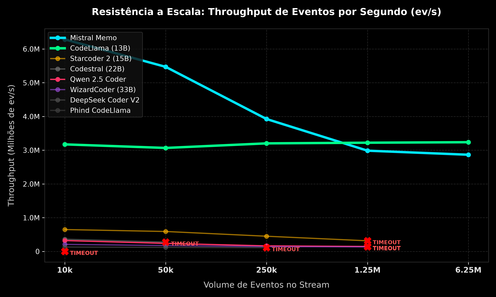
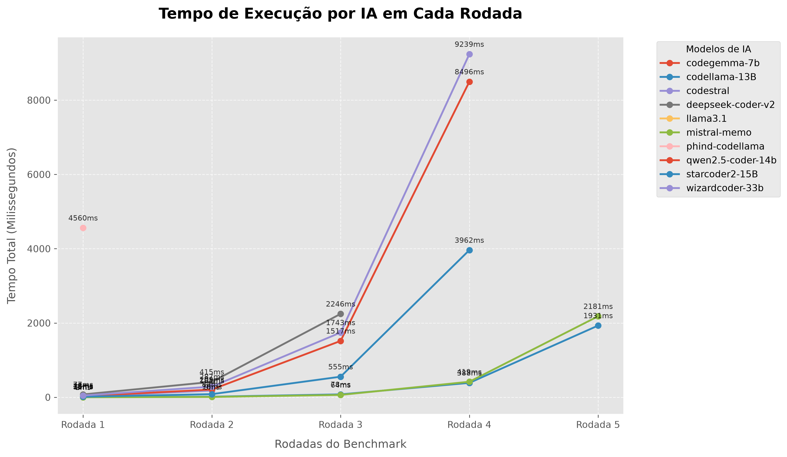

# AI Code Benchmark — Testador de Desempenho de Código Gerado por IA




> Plataforma de benchmark automatizado para avaliar e comparar a performance de código Python gerado por diferentes modelos de IA (LLMs de código), medindo **tempo de execução**, **throughput (eventos/s)** e **resistência a escala** em rodadas progressivas de carga.

## 1. Visão Geral e Arquitetura

- **Stack Tecnológica:** Python 3.11+, Matplotlib, NumPy, openpyxl
- **Padrão Arquitetural:** Script-based pipeline — orquestrador central (`tester.py`) executa módulos isolados em subprocessos e exporta os resultados para Excel e gráficos
- **Design Patterns Principais:** Multiprocessing com isolamento por processo (timeout rígido de 10s), Dynamic Module Loading (`importlib`), Dataclass imutável para transporte de resultados

O sistema segue um fluxo linear:

```text
tester.py (orquestrador)
   │
   ├── Carrega módulos de IA de modelos/
   ├── Executa cada módulo em subprocesso isolado (multiprocessing)
   ├── Coleta métricas (tempo, throughput, status)
   │
   ├── excel_exporter.py  →  Exporta resultados formatados para .xlsx
```

## 2. Módulos e Componentes Principais

- **`tester.py`** — Orquestrador principal do benchmark. Gera listas de eventos aleatórios em escala crescente (10k → 6.25M), executa cada modelo em subprocesso com timeout de 10s, coleta métricas de tempo e throughput, e elimina modelos que ultrapassam o limite. Exporta os resultados via `excel_exporter`.
- **`excel_exporter.py`** — Módulo de exportação para Excel. Recebe uma lista de `BenchmarkResult` (dataclass imutável com `arquivo`, `eventos`, `tempo_total`, `throughput`, `status`) e gera uma planilha `.xlsx` estilizada com rodadas separadas em blocos de colunas, cabeçalhos coloridos e redimensionamento automático.
- **`modelos/`** — Diretório contendo os 10 scripts Python gerados por diferentes modelos de IA. Cada um implementa a função `process_events(events, k, target_user_id)` que processa uma lista de eventos `(user_id, score)` e retorna um ranking top-K de usuários.

### Modelos testados

| Modelo | Arquivo | Observação |
|---|---|---|
| Mistral (Memo) | `mistral-memo.py` | Líder em throughput inicial, queda progressiva |
| CodeLlama 13B | `codellama-13B.py` | Throughput mais estável em todas as rodadas |
| Starcoder 2 (15B) | `starcoder2-15B.py` | Eliminado na rodada 5 |
| Codestral (22B) | `codestral.py` | Eliminado na rodada 3 |
| Qwen 2.5 Coder (14B) | `qwen2.5-coder-14b.py` | Eliminado na rodada 5 |
| WizardCoder (33B) | `wizardcoder-33b.py` | Eliminado na rodada 5 |
| DeepSeek Coder V2 | `deepseek-coder-v2.py` | Eliminado na rodada 4 |
| Phind CodeLlama | `phind-codellama.py` | Eliminado na rodada 2 |
| CodeGemma (7B) | `codegemma-7b.py` | Eliminado na rodada 1 |
| Llama 3.1 (8B) | `llama3.1.py` | Eliminado na rodada 1 |

## 3. Estrutura de Pastas

```text
testes/
├── tester.py                  # Orquestrador principal do benchmark
├── excel_exporter.py          # Exportação dos resultados para Excel
├── resultados_benchmark.xlsx  # Planilha com resultados das rodadas
├── modelos/                   # Scripts de IA gerados por LLMs
│   ├── codegemma-7b.py
│   ├── codellama-13B.py
│   ├── codestral.py
│   ├── deepseek-coder-v2.py
│   ├── llama3.1.py
│   ├── mistral-memo.py
│   ├── phind-codellama.py
│   ├── qwen2.5-coder-14b.py
│   ├── starcoder2-15B.py
│   └── wizardcoder-33b.py
```

## 4. Pré-requisitos e Infraestrutura

- **Runtime:** Python 3.11+
- **Gerenciador de pacotes:** pip (via `requirements.txt` ou instalação manual)
- **Dependências Python:**
  - `matplotlib` — Geração do gráfico comparativo
  - `numpy` — Suporte numérico para o gráfico
  - `openpyxl` — Exportação dos resultados para Excel (.xlsx)

## 5. Configuração de Variáveis de Ambiente (.env)

Este projeto não utiliza variáveis de ambiente. Toda a configuração é feita por constantes internas no `tester.py`:

| Constante | Descrição | Valor Padrão |
|---|---|---|
| `num_users` | Universo de IDs de usuário para gerar eventos | `100_000` |
| `k` | Quantidade de recomendações (top-K) | `10` |
| `target_user` | ID do usuário-alvo no benchmark | `42` |
| `max_allowed_time` | Timeout máximo por modelo por rodada (segundos) | `10.0` |
| `event_sizes` | Escala progressiva de eventos por rodada | `[10k, 50k, 250k, 1.25M, 6.25M]` |

## 6. Setup e Execução

**Instalação**

```bash
git clone <url-do-repositorio>
cd testes
python -m venv .venv
```

**Ativação do ambiente virtual**

```bash
# Windows (PowerShell)
.\.venv\Scripts\Activate.ps1

# Linux / macOS
source .venv/bin/activate
```

**Instalação das dependências**

```bash
pip install matplotlib numpy openpyxl
```

**Executar o benchmark completo**

```bash
python tester.py
```

A saída será exibida no terminal com o resultado de cada modelo por rodada, e ao final o arquivo `resultados_benchmark.xlsx` será gerado automaticamente.

## 7. Scripts, Testes e Qualidade

- `python tester.py` — Executa o benchmark completo (5 rodadas, 10 modelos) e exporta para Excel.
- Cada modelo em `modelos/` pode ser executado individualmente, desde que receba os parâmetros esperados pela função `process_events(events, k, target_user_id)`.

### Como funciona o benchmark

1. O `tester.py` gera listas de eventos `(user_id, item_id)` com seed fixa (`random.seed(42)`) para reprodutibilidade.
2. Cada modelo é executado em um **subprocesso isolado** via `multiprocessing.Process`.
3. O timeout rígido é de **10 segundos** — modelos que excedem são **eliminados** de rodadas futuras.
4. As métricas coletadas por rodada são: **tempo total (s)** e **throughput (eventos/s)**.
5. Os resultados são exportados para uma planilha Excel estilizada com cabeçalhos, bordas e colunas redimensionadas automaticamente.

## 8. Documentação da API e Contratos

### Contrato dos módulos de IA (`modelos/*.py`)

Cada script deve expor obrigatoriamente a seguinte função:

```python
def process_events(
    events: list[tuple[int, int]],  # Lista de (user_id, item_id)
    k: int,                          # Top-K recomendações
    target_user_id: int              # Usuário-alvo
) -> list[tuple[list[tuple[int, int]], int]]:
    ...
```

### Estrutura do `BenchmarkResult` (dataclass)

```python
@dataclass(slots=True, frozen=True)
class BenchmarkResult:
    arquivo: str           # Nome do arquivo do modelo
    eventos: int           # Quantidade de eventos na rodada
    tempo_total: float | str
    throughput: float | str
    status: str            # "OK", "Eliminado (>10s)", "Pulado", "Erro: ..."
```

## 9. CI/CD e Deploy

Este projeto é executado localmente como ferramenta de benchmark. Não possui pipelines de CI/CD nem estratégia de deploy.

## 10. Troubleshooting e FAQ

- **Problema:** `ModuleNotFoundError: No module named 'openpyxl'`
  **Solução:** Instale a dependência com `pip install openpyxl`. Verifique se o ambiente virtual está ativado.

- **Problema:** Todos os modelos são eliminados na rodada 1 por timeout.
  **Solução:** Verifique se sua máquina está sob carga pesada. O timeout padrão é de 10s — em máquinas mais lentas, considere aumentar `max_allowed_time` no `tester.py`.

- **Problema:** `SyntaxError: from __future__ imports must occur at the beginning of the file` ao executar um modelo.
  **Solução:** Garanta que a instrução `from __future__ import annotations` seja a primeira linha de código (exceto comentários/docstrings) em qualquer modelo que a utilize.

- **Problema:** Nomes de arquivo com hífen (ex: `codegemma-7b.py`) não podem ser importados diretamente via `import`.
  **Solução:** O `tester.py` já utiliza `importlib.util.spec_from_file_location` para contornar essa limitação. Não tente importar esses módulos com `import` direto.
